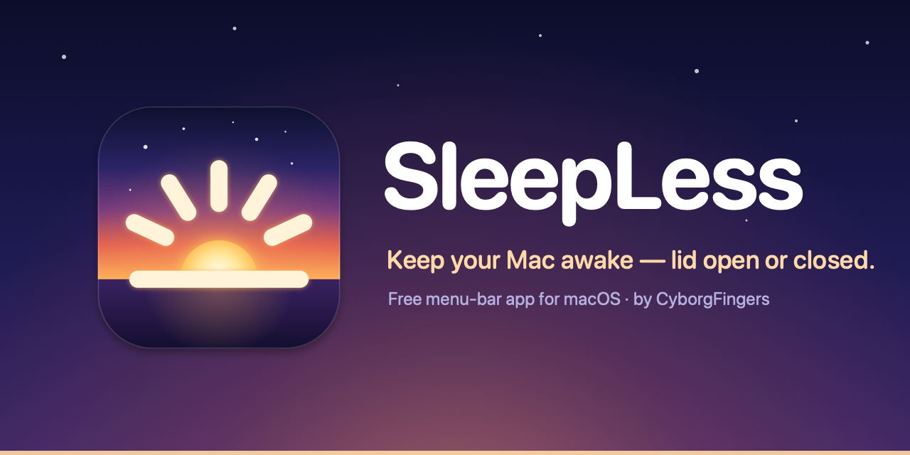
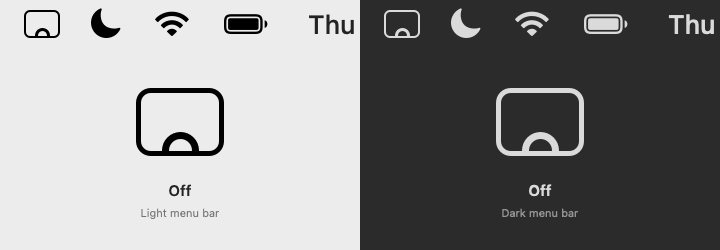
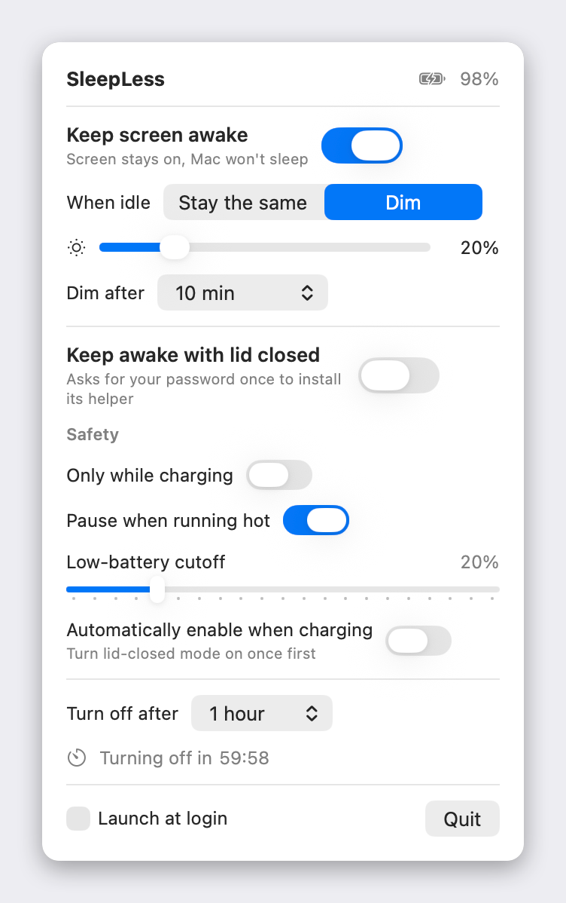
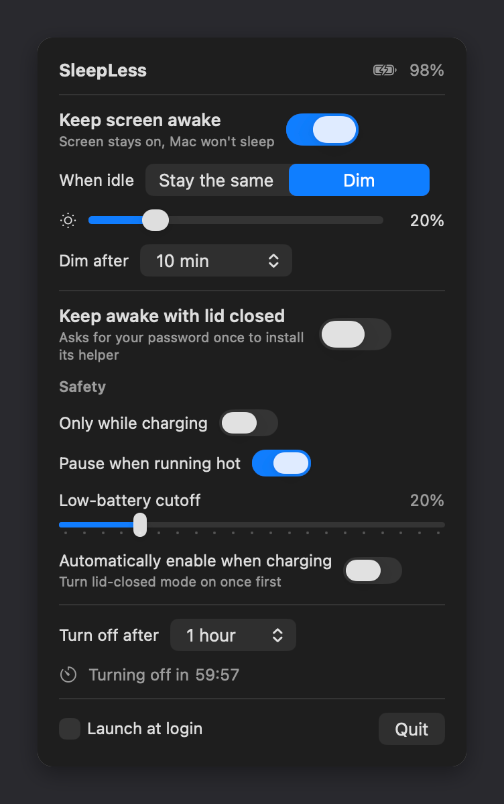

<p align="center">
  
</p>

<p align="center">
  
  
  
  <a href="https://github.com/Weta-Technologies/SleepLess/releases/latest"></a>
  <a href="LICENSE"></a>
</p>

<p align="center">
  <a href="https://github.com/Weta-Technologies/SleepLess/releases/latest/download/SleepLess.pkg"></a>
  <br>
  <sub>macOS 13+ · Apple Silicon · free · Weta Technologies Limited · GitHub: <a href="https://github.com/CyborgFingers">CyborgFingers</a></sub>
</p>

**SleepLess** is a tiny macOS menu-bar app that keeps your Mac awake — with the lid open (optionally dimming the screen) *or* with the lid closed — with sensible safety cut-offs, an auto-off timer, and a helper that can never leave your Mac stuck awake.

<p align="center">
  
</p>

## Features

- **Keep screen awake** (lid open) — holds the same power assertions as `caffeinate -di`: the screen never idle-dims or sleeps and the Mac never idle-sleeps. No admin rights needed.
- **Screen when idle** — *Stay the same*, or *Dim* to a brightness you choose (0–100 %) after an idle delay (right away, 30 s, 1, 2, 5 or 10 min). Any keyboard or mouse input restores your original brightness instantly; so does turning it off or quitting. It never brightens a screen that is already below the target. The keyboard backlight is left alone.
- **Keep awake with lid closed** — the only thing that beats lid-close sleep on Apple Silicon is the `SleepDisabled` flag (`sudo pmset -a disablesleep 1`). SleepLess sets it through a tiny root helper that you set up once — one macOS prompt, your password or Touch ID — and that afterwards updates itself only from files signed by Weta Technologies, so nothing ever asks again. Close the lid and the screen and keyboard backlight go dark while everything keeps running; open it and you're right where you left off — no unlock needed.
- **Charging light off when closed** — in lid-closed mode, closing the lid switches the MagSafe connector's light off (handy in a dark bedroom); opening it gives the light back to macOS in the right colour. On by default; a switch under *Safety* turns it off.
- **Safety cut-offs** for lid-closed mode, tucked under a *Safety* disclosure with a one-line summary — *Only while charging*, *Pause when running hot* (thermal state serious/critical), a *Low-battery cutoff* slider (default 20 %, 0 = never) and *Turn on when charging* (follows plug/unplug).
- **Turn off after** — never, 15 min, 30 min, 1, 2 or 4 hours, with a live countdown and progress bar. When the timer ends everything turns off.
- **One click on, one click off** — a quick click on the menu-bar icon turns SleepLess on (bringing back the modes you last had on; screen awake by default) or off. Press and hold the icon, or right-click it, for the settings panel.
- **Watchdog** — the helper treats a request older than 90 s (app quit, crashed or hung) as "off", so your Mac can never get stuck unable to sleep. Quitting the app restores normal sleep immediately.
- **Animated menu-bar icon** — a screen with the app icon's sunrise inside. Off is a hollow sun resting on the bottom of the screen. Turn SleepLess on and the sun climbs in and five rays fan out one after another; they breathe slowly while it is on, and it all sets again when it turns off. In lid-closed mode the sun lifts to the middle of the screen as a full disc. It is a template image, so it matches light and dark menu bars; the animation pauses while your screens sleep, and under Reduce Motion it simply switches between still frames.
- **Launch at login** (on by default after the first launch) and settings that persist.
- **Updates itself** — checks GitHub about once a day (you can turn that off), shows an *Update available* card in the panel and a dot on the icon, and **Update Now** installs the signed update and relaunches with your settings intact. [Details below.](#updates)
- One panel in the menu bar with a live status header, a card per mode, tooltips on everything and full VoiceOver and keyboard support; it respects Reduce Motion and Increase Contrast. No Dock icon, no analytics, no network beyond the update check.

## Screenshots

| Light | Dark |
| :---: | :---: |
|  |  |

## How it works

### Lid open

*Keep screen awake* creates two IOKit power-management assertions — `PreventUserIdleDisplaySleep` and `PreventUserIdleSystemSleep` — exactly what `caffeinate -di` does. They are released the moment you turn it off or quit. Dimming reads and writes the built-in display's brightness through the same private `DisplayServices` calls the brightness keys use, and watches the idle time of the session to restore it on the first key press or mouse move.

### Lid closed

Assertions do not stop a MacBook from sleeping when the lid closes. The only reliable override on Apple Silicon is `SleepDisabled` in `IOPMrootDomain`, which needs root. SleepLess therefore installs a **root launchd helper** — a short shell script, [`sleepless-helper.sh`](sleepless-helper.sh). The Installer package does it under its own admin prompt, so the helper is there before the menu-bar icon first appears; a copy built from source gets the panel's one-time setup card (or the *Set up…* button on this card) instead — either way a single macOS authorization prompt, your password or Touch ID, installs everything SleepLess will ever need as root. From then on nothing asks again — a new version's helper files are installed by the helper itself, and only when they carry a manifest signed with the Weta Technologies publisher key (see [Updates](#updates)):

1. The app writes `1` or `0` to `/Library/Application Support/SleepLess/lid` and rewrites it every 30 s while lid-closed mode is on.
2. launchd runs the helper on every write and every 30 s; the helper runs `pmset -a disablesleep 1` or `0` to match.
3. **Watchdog:** a request file older than 90 s counts as `0`. If the app crashes or hangs, normal sleep comes back within about two minutes (90 s of staleness plus up to 30 s until the helper's next run). Quitting normally restores it immediately.
4. The helper only ever undoes a `SleepDisabled` that it set itself (it keeps a marker file), so it will not fight `pmset` or another tool.
5. **Charging light:** the app writes `off` (lid closed) or `on` (lid open) to `/Library/Application Support/SleepLess/led`; the helper passes only those two words to a tiny tool, [`sleepless-led`](sleepless-led.c), which writes the one SMC key that picks the MagSafe light's colour (`off` = light off; `on` = the colour macOS would show right now, then back to macOS). Each request is applied once, and the watchdog also restores the light if the app dies with it off.

**Dark screen, Mac on, no unlock.** With the lid shut, SleepLess doesn't leave the display lit: it watches the lid sensor (`AppleClamshellState`), and once the lid is closed — with no external monitor connected — it saves your screen and keyboard-backlight levels and turns both down to 0 (pausing the keyboard's ambient-light adjustment). It deliberately does *not* put the display to sleep: a sleeping display trips macOS's "require password" lock, a dark one doesn't. So the Mac stays fully awake, apps, downloads and agents keep running, and when you open the lid your levels come back and you're straight back in your session. With a monitor plugged in it's ordinary clamshell use, and SleepLess leaves the screens alone.

> **Heads-up:** because the screen never "turns off", opening the lid doesn't ask for your password — the same as Lidless. If you want it locked, press ⌃⌘Q before you close the lid (it keeps running either way).

The app also reads the live `SleepDisabled` flag, so the panel shows whether lid-closed mode is *really* active, and tells you if something else has disabled sleep.

### Compared with

| | `caffeinate` | [Lidless](https://github.com/nghialuong/Lidless) | SleepLess |
| --- | :---: | :---: | :---: |
| Keep the screen on (lid open) | ✓ | | ✓ |
| Dim the screen while idle | | | ✓ |
| Keep awake, lid closed (`SleepDisabled`) | | ✓ | ✓ |
| Safety cut-offs (charging / thermal / battery) | | ✓ | ✓ |
| Auto-off timer with countdown | `-t` seconds | ✓ | ✓ |
| Watchdog restores sleep if the app dies | n/a | ✓ | ✓ |
| Root helper | none | XPC daemon via `SMAppService` | shell script via launchd, one prompt (password or Touch ID), signed self-updates |
| Download | | notarized DMG, auto-updates | Installer package (not yet notarized), signed in-app updates, or build from source |

If you want a mature, feature-rich alternative with a notarized download, [Amphetamine](https://apps.apple.com/app/amphetamine/id937984704) is the well-known one.

## Install

### Download (easiest)

1. **[Download SleepLess.pkg](https://github.com/Weta-Technologies/SleepLess/releases/latest/download/SleepLess.pkg)** — always the latest release ([all releases](https://github.com/Weta-Technologies/SleepLess/releases)).
2. Open it: **Continue**, **Agree** to the licence, **Install**. macOS asks for your password or Touch ID **once**: that puts SleepLess into Applications and sets up its helper, and SleepLess opens in your menu bar with lid-closed mode ready. Nothing asks again — not the app, and not later updates.

   The package and the app are Developer ID signed and notarized by Apple (the official builds are signed and notarized by Weta Technologies Limited — see [SECURITY.md](SECURITY.md) for how to check a download), so there is no Gatekeeper step and the app opens without a warning. Requires an Apple Silicon Mac running macOS 13 or later. Running the package again over an installed SleepLess (or a newer one) simply upgrades it; your settings are kept. (The 1.0 release was an unsigned drag-to-Applications DMG: if you still have that one, macOS 15 and later make you allow it under *System Settings → Privacy & Security → Open Anyway* — the package replaces it, and does not.)

### Build from source

You need Xcode or the Command Line Tools (`xcode-select --install`).

```bash
git clone https://github.com/Weta-Technologies/SleepLess.git
cd SleepLess
./build.sh install   # builds build/SleepLess.app, copies it to /Applications and launches it
```

`./build.sh` on its own just builds `build/SleepLess.app`. The app is ad-hoc signed; because you build it on your own Mac there is no download quarantine and no Gatekeeper prompt. `./make-pkg.sh` builds the Installer package (`build/SleepLess.pkg`) that is attached to each release: the app, the licence pane, and pre/post-install scripts ([`pkg/`](pkg/)) that quit a running copy properly, hand the app to the logged-in user, install the helper for them and open the app.

## First run

- SleepLess lives in the **menu bar** — look for the small screen-with-a-sunrise icon. There is no Dock icon. **Click** the icon to turn SleepLess on or off; **press and hold** it (or right-click / ⌃-click) for the settings panel. The panel shows this tip once.
- It registers itself as a **login item** on first launch (macOS may show a "background items added" notification). Untick *Launch at login* in the panel if you would rather not.
- Installed with the package, the helper behind lid-closed mode and the charging light is already set up — the installer's prompt was the one. Built from source, the panel opens with a **one-time setup** card instead: **Set up now** brings one macOS prompt — your password, or Touch ID on Macs that have it — and nothing asks again; **Later** leaves those two features off, each with its own *Set up…* button, until you are ready. (A *Reinstall helper…* link under *Safety* is there if the helper is ever removed.)
- If you use **Bartender**, **Ice** or a similar menu-bar organiser, or your menu bar is crowded next to the notch, the icon may be hidden — look for it there.

## Usage

A **quick click** on the menu-bar icon turns SleepLess on or off: on brings back whatever modes you last had on (screen awake the first time), off turns everything off. **Press and hold** the icon, or **right-click** / **⌃-click** it, to open the settings panel; Esc, another click on the icon, or a click anywhere else closes it.

| Control | What it does |
| --- | --- |
| **Status header** | The big glyph and sentence say what SleepLess is doing right now; its switch is the same on/off as a click on the menu-bar icon. |
| **Keep screen awake** | Screen stays on and the Mac will not idle-sleep while the lid is open. |
| **When idle** — *Stay the same* / *Dim* (shown while the mode is on) | With *Dim*, pick the brightness (*Dim to*) and the idle delay (*After*). Brightness returns on the first key press or mouse move. |
| **Keep awake with lid closed** | Sets `SleepDisabled` through the root helper. Closing the lid turns the screen and keyboard light down to off while the Mac keeps running, without locking. The subtitle shows the real state. |
| **Safety** (disclosure, with a summary like *Stops at 20 % · Pauses when hot* and the battery level) | The rules below. |
| **Only while charging** | Lid-closed mode turns off (and refuses to turn on) unless the charger is connected. Disables the battery cutoff, since it is no longer needed. |
| **Pause when running hot** | Turns lid-closed mode off while the Mac's thermal state is serious or critical. |
| **Low-battery cutoff** | Turns lid-closed mode off when the battery reaches this level on battery power (default 20 %, 0 = never). |
| **Turn on when charging** | Turns lid-closed mode on when you plug in and off when you unplug (after the helper has been installed once). A manual flip sticks until the next plug/unplug. |
| **Turn off after** | *Never*, 15 min – 4 hours: turns *everything* off, with a live countdown and progress bar. Picking a new value restarts the countdown. |
| **Launch at login** / **Quit** | Quitting releases the assertions, restores brightness and tells the helper to restore normal sleep straight away. |

Every control has a tooltip, everything works with the keyboard and VoiceOver, and the panel respects Reduce Motion (no shimmer, no transitions) and Increase Contrast.

Whenever a safety guard turns something off, the panel tells you why.

## Updates

SleepLess checks GitHub for a newer release about 10 seconds after launch and then once a day — one plain request to `api.github.com` for the latest release, with no account and nothing about you or your Mac — and whenever you click **Check for Updates** in the panel. Untick **Check for updates automatically** to stop the daily check (the button still works). When there is one, the panel shows an *Update available* card with the version, the first lines of the release notes and a *What's new…* link, and a small dot appears on the menu-bar icon (macOS may also show a notification, if you allow SleepLess notifications).

**Update Now** downloads `SleepLess.app.zip` from the release and checks its **Ed25519 signature** against the Weta Technologies publisher key built into the app — a download that doesn't verify is never unpacked. It then unpacks the zip beside the app, checks that the new bundle really is SleepLess at the advertised, newer version with a valid code signature, and hands over to a tiny script that waits for SleepLess to quit, swaps the two bundles with two renames (the old one is put back if anything fails) and relaunches. SleepLess quits normally, so brightness, the keyboard light and the charging light are handed back first. It all takes a couple of seconds. **Later** hides the card until the next check; **Skip** ignores that version.

Your settings live outside the app (`~/Library/Preferences/io.github.cyborgfingers.sleepless.plist`), so they survive, and so does *Launch at login*. If the update changes the helper, the installed helper takes the new files by itself: they come with a manifest signed with the same publisher key, which the root-owned helper verifies (signature, every file's hash, no downgrade) before installing anything, so there is no new prompt. If SleepLess can't replace itself where it is — in a folder you can't write to, say — the card says so and offers the download page instead (the package installs over the old version too).

## Safety

- Lid-closed mode is guarded by the thermal, charging and battery rules above, checked every second.
- The root helper's **90 s watchdog** means a crashed, killed or hung SleepLess cannot leave your Mac unable to sleep.
- The helper never touches a `SleepDisabled` it did not set.
- Quitting restores brightness and normal sleep immediately; lid-closed mode is remembered and resumes on the next launch, subject to the same guards.
- Dimming never brightens your screen and always restores exactly the brightness you had.

## Uninstall

Quit SleepLess, then remove the helper (this restores normal sleep) and, if you installed with the package, its receipt:

```bash
sudo /bin/sh /Applications/SleepLess.app/Contents/Resources/sleepless-helper.sh uninstall
sudo pkgutil --forget io.github.cyborgfingers.sleepless.pkg
```

and move `/Applications/SleepLess.app` to the Trash. If you built from source, `./build.sh uninstall` does all of it. The helper's files are:

- `/Library/PrivilegedHelperTools/io.github.cyborgfingers.sleepless.lid.sh` (and `.led`, `.verify`, `.pub`, `.manifest` beside it)
- `/Library/LaunchDaemons/io.github.cyborgfingers.sleepless.lid.plist`
- `/Library/Application Support/SleepLess/`

If SleepLess is still listed under *System Settings → General → Login Items*, untick it there. Settings (and the modes a click brings back) live in `~/Library/Preferences/io.github.cyborgfingers.sleepless.plist`; `defaults delete io.github.cyborgfingers.sleepless` clears them.

## Testing

```bash
./build.sh && build/SleepLess.app/Contents/MacOS/SleepLess --selftest
```

checks the brightness round-trip (it briefly nudges brightness by 10 %), that both sleep assertions register, that the battery can be read, the menu-bar click logic (tap / hold / right-click, and what a tap turns on and off), and the updater's pure parts — version ordering (1.10 > 1.9, tags with and without `v`, pre-releases ignored), the release-feed parser, Ed25519 verification with a throwaway key pair (good, tampered, wrong key), and the bundle-swap script on a fake app in a temp folder (a success, and a failure that must put the old app back) — handy after a macOS update, since brightness uses a private API.

```bash
./test-helper.sh
```

runs the helper against a fake `pmset` and a fake light tool (no root needed) and checks that a fresh request disables sleep, a stale request restores it, a `SleepDisabled` set by someone else is left alone, a `0` request undoes the helper's own `SleepDisabled`, only `off`/`on` ever reach the light tool, and — with throwaway keys and a fake app bundle — that a signed helper update is installed exactly once, while a file changed after signing, a manifest signed with another key, a downgrade, an unsigned bundle, a symlinked request and a request that isn't an app path all leave the installed helper untouched.

```bash
./test-update.sh
```

runs the in-app updater end to end without GitHub: it serves a fake latest-release feed and a signed zip of this build re-versioned as 9.9.9 from a local web server, then runs a *copy* of the app from a temp folder with `--update-test <feed> <key> <log>`, which does exactly what Update Now does — check, download, verify, unpack, sanity-check, swap, relaunch — and proves the copy comes back as 9.9.9 with nothing left behind, that a zip signed with the wrong key and a tampered zip are refused with the copy untouched, and that your real settings never change. Your installed SleepLess is not involved.

## Security & privacy

- **No analytics, no accounts.** The only network activity is the [update check](#updates) — a plain request to GitHub for the latest release, about once a day, which you can turn off — and the download you start with Update Now. Nothing about you or your Mac is sent.
- **Updates are signed.** Every release's `SleepLess.app.zip` carries an Ed25519 signature made with the Weta Technologies publisher key; the app verifies it with the public key compiled in ([`cyborgfingers.pub`](cyborgfingers.pub)) before unpacking, then checks the bundle id, version and code signature of what it unpacked. Nothing from a download ever runs except that verified app.
- **Brightness** is read and set through the private `DisplayServices` framework (`DisplayServicesGetBrightness` / `DisplayServicesSetBrightness`). Private APIs can change between macOS releases; `--selftest` tells you if they did.
- **The root helper** is a short, readable shell script. It only ever runs `pmset -g` and `pmset -a disablesleep 0|1`, plus `sleepless-led off|on` for the charging light (that tool only ever writes the one SMC key that picks the MagSafe light's colour). It is installed by `/bin/sh sleepless-helper.sh install <user>` after the system's authorization prompt (Authorization Services, `system.privilege.admin` — the same sheet installers use, with Touch ID where macOS offers it), and the app checks that the installed copy is byte-for-byte identical to the one in its bundle before trusting it.
- **The helper updates itself only from signed files.** When a new version of SleepLess changes it, the app writes its bundle path to a request file; the root helper copies the files into a root-owned folder first, runs its own root-owned verifier (`sleepless-verify`, compiled from [`tools/helper-verify.swift`](tools/helper-verify.swift)) against the root-owned copy of the publisher key — manifest signature, every file's hash, no downgrade — and only then installs them, each with a rename. Anything else is ignored, and the panel offers the setup card instead. The prompt at setup is therefore the only one there will ever be.
- **The request file** (`/Library/Application Support/SleepLess/lid`) is owned by your user in a root-owned directory. Any process running as your user could write `1` to it. The impact is limited to keeping the Mac awake (with the lid closed) while that process keeps rewriting the file, and the 90 s watchdog still applies. The helper reads only the first byte.
- The app is **not sandboxed** (it needs IOKit and the private brightness API) and is ad-hoc signed; you build it yourself.

## Credits

SleepLess was inspired by [Lidless](https://github.com/nghialuong/Lidless) (MIT) — the lid-closed `SleepDisabled` approach, the safety guards, the watchdog idea and the lid-shaped glyph all come from there. SleepLess is an independent implementation with no code or artwork copied, and adds the lid-open, dimming and single-shell-script-helper side.

## License

**SleepLess is copyright © 2026 Weta Technologies Limited. All rights reserved. Developed by Weta Technologies Limited · GitHub: [CyborgFingers](https://github.com/CyborgFingers).**

SleepLess is **freeware**: you may download and use it free of charge on any Macs you own or control, for personal or business use. You may not modify, decompile, redistribute, sell or host it; please share the [official download](https://github.com/Weta-Technologies/SleepLess/releases/latest) instead. The source is published so you can see exactly what SleepLess does. It is not open source, and viewing it gives no rights beyond the licence. The installer asks you to accept the licence before installing.

- [Licence agreement](LICENSE) (governed by New Zealand law)
- [Privacy policy](PRIVACY.md): SleepLess collects nothing
- [Trademark policy](TRADEMARKS.md) · [Security policy](SECURITY.md) · [Contributing](CONTRIBUTING.md) · [Notices](NOTICE.md)

SleepLess 1.0.0 and the source published before 26 September 2026 were released under the GNU AGPL-3.0; copies of those versions keep that licence.

Apple, Mac, macOS and MagSafe are trademarks of Apple Inc. SleepLess is not affiliated with or endorsed by Apple Inc.
